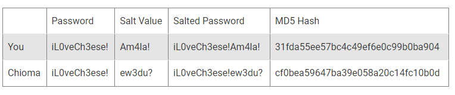
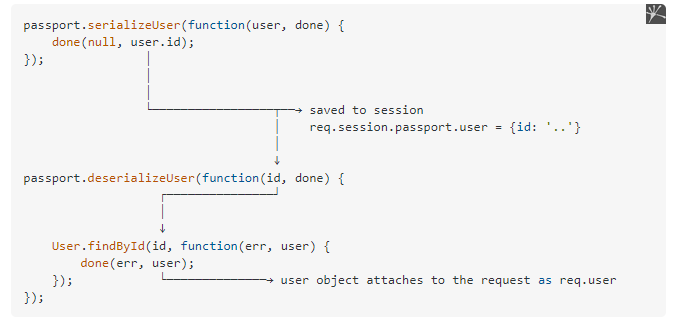

"# node_passport_login" 

# first dependeceis
npm i express bcryptjs passport passport-local ejs express-ejs-layouts mongoose connect-flash express-session

 npm i -D nodemon
 

# salting and hashing 

> blockquote Hashing takes plaintext data elements and converts them into consistent ciphertext outputs used for data verification. Salting adds random characters to data, like passwords, to thwart hackers who look for consistent words and phrases in sensitive data in order to decode it.23 jui. 2022


```
bcrypt.genSalt(saltRounds, function(err, salt) {
  bcrypt.hash(password, salt, function(err, hash) {
  // returns hash
  console.log(hash);
  });
});
```

# To Make Password Hashes Unique

>Salting is also important when two or more users have the same passwords. Adding different randomized salts to each password helps to make each unique. For example, if your password is iL0veCh3ese! and another user, Chioma, has that exact password, salting is used to make those password hashes unique.




# passport serialize and deserialaze


